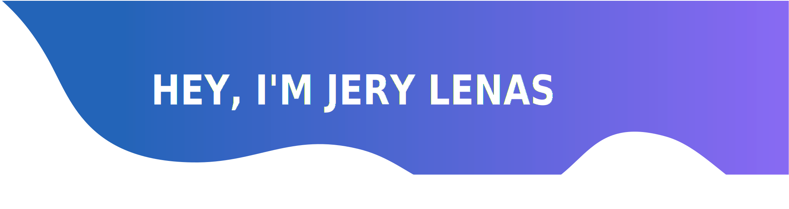

<!--  -->

<!-- # Hi There, I'm Jery Lenas -->

 &nbsp;
&nbsp;
&nbsp;

I love coding in . I work at [Nutech Integrasi](https://www.nutech-integrasi.com/) which is located in south jakarta, as a Backend Developer use  and for Frontend i usually use  and React Native for Mobile App  

⚡ Fun fact:

- 🌱 I’m currently learning ReactJs.
- :pencil2: learn UI/UX on free days.
- :musical_note: I love playing guitar and hear classic instrumental music.  
- :loop: My daily routine consists of (but not limited to) drinking coffee, coding, reading book, overcoming boredom 😉.

<!-- ### Let's Connect :coffee: -->
   <h4 align="center">Let's Connect :coffee:</h4>

    
    
    
    

